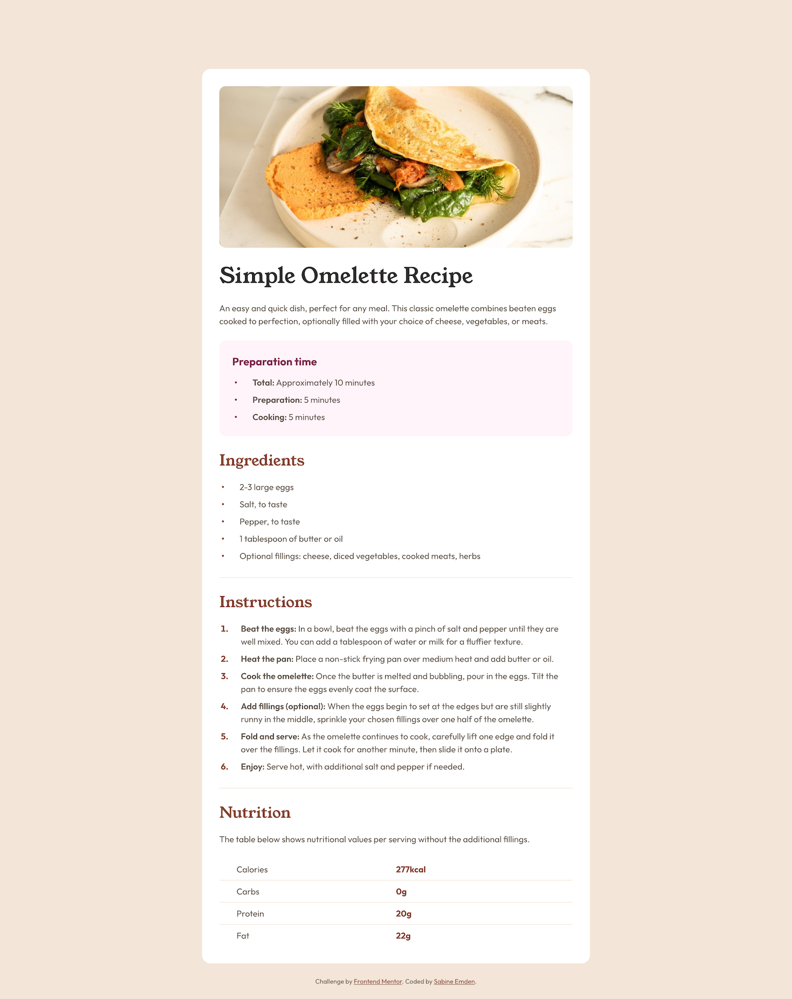

# Frontend Mentor - Recipe page solution

This is a solution to the [Recipe page challenge on Frontend Mentor](https://www.frontendmentor.io/challenges/recipe-page-KiTsR8QQKm). Frontend Mentor challenges help you improve your coding skills by building realistic projects.

## Table of contents

- [Overview](#overview)
  - [The challenge](#the-challenge)
  - [Screenshot](#screenshot)
  - [Links](#links)
- [My process](#my-process)
  - [Built with](#built-with)
  - [What I learned](#what-i-learned)
  - [Continued development](#continued-development)
  - [Useful resources](#useful-resources)
- [Author](#author)
- [Acknowledgments](#acknowledgments)

## Overview

### The challenge

The brief for this project was to build out the recipe page and get it looking as close to the design as possible, starting with the following assets:

- JPEG design files for mobile & desktop layouts
- Style guide for fonts, colors, etc.
- Optimized image assets
- Variable and static font files
- HTML file with pre-written contents

### Screenshot



### Links

- [Frontend Mentor solution]() - LINK COMING SOON
- [GitHub repository](https://github.com/SabineEmden/fm-recipe-page)
- [Live site](https://sabineemden.github.io/fm-recipe-page/)

## My process

### Built with

- Semantic HTML5 markup
- CSS custom properties
- Mobile-first workflow

### What I learned

This solution includes three things that were new to me:

- Styling list markers
- Styling HTML tables
- Using media queries

The recipe page contains two unordered lists with preparation time and ingredients, respectively, and an ordered list with the instructions.

For the ordered list, I styled the counters using the `::marker` pseudo-element:

```css
.instructions li::marker {
  font-weight: 700;
  color: var(--brown-800);
}
```

Styling the list markers for the unordered lists was a bit more challenging. In the JPEG design file for the mobile layout, the markers do not sit next to the first line of text but are centered vertically if the text content of the list item wraps over two lines. I used custom markers with the `::before` pseudo-element to position the markers with flexbox.

```css
.unordered {
  list-style: none;
  padding-left: 0;
}

.unordered li {
  display: flex;
  align-items: center;
  gap: 1.75rem;
  padding-left: 0.25rem;
}

.unordered li::before {
  content: "•";
  font-weight: 700;
}
```

### Continued development

I need to learn image optimization! Currently, the largest file in this project is the screenshot I took for this README. I learned how to optimize font files. Now the file size of the screenshot is larger than the size of all font files combined.

### Useful resources

- [Creative list styling](https://web.dev/articles/creative-list-styling) by Michelle Barker for web.de - This article helped me to figure out how to style the list markers for both the ordered and unordered lists.
- [Styling tables](https://developer.mozilla.org/en-US/docs/Learn/CSS/Building_blocks/Styling_tables) on MDN - This article is a good refresher for basic table styling techniques.

## Author

- Frontend Mentor - [@SabineEmden](https://www.frontendmentor.io/profile/SabineEmden)
- Mastodon - [@sabineemden](https://mastodon.online/@sabineemden)

## Acknowledgments

This project uses Josh Comeau's [CSS reset](https://www.joshwcomeau.com/css/custom-css-reset/).

The font families used in this project are [Young Serif](https://fonts.google.com/specimen/Young+Serif) and [Outfit](https://fonts.google.com/specimen/Outfit). The fonts are licensed under the [Open Font License](https://openfontlicense.org).
